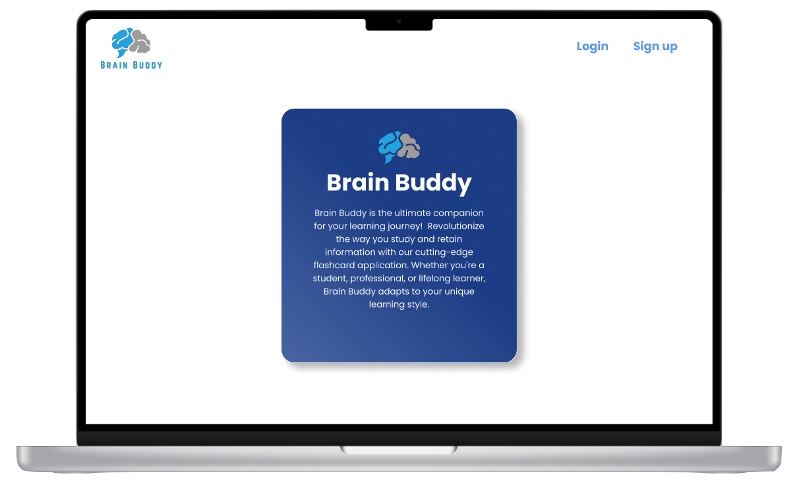
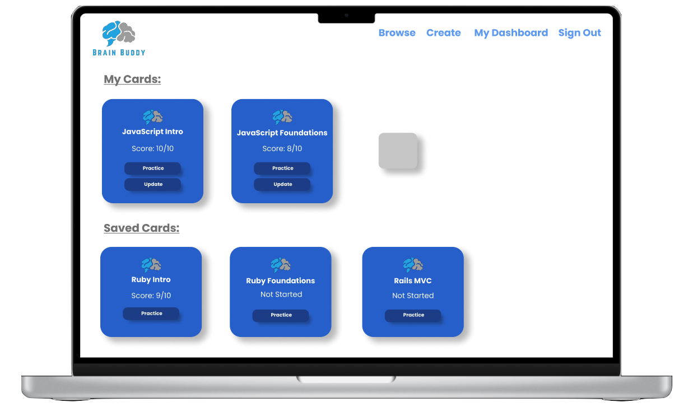
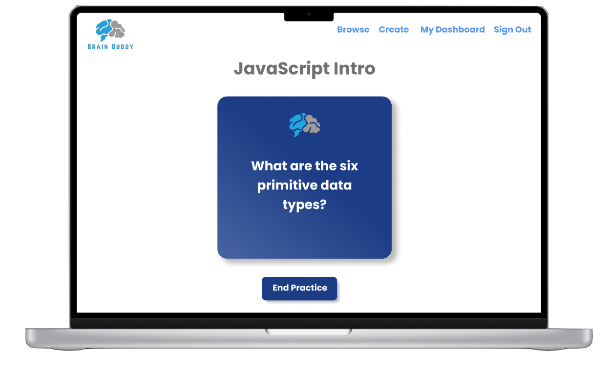
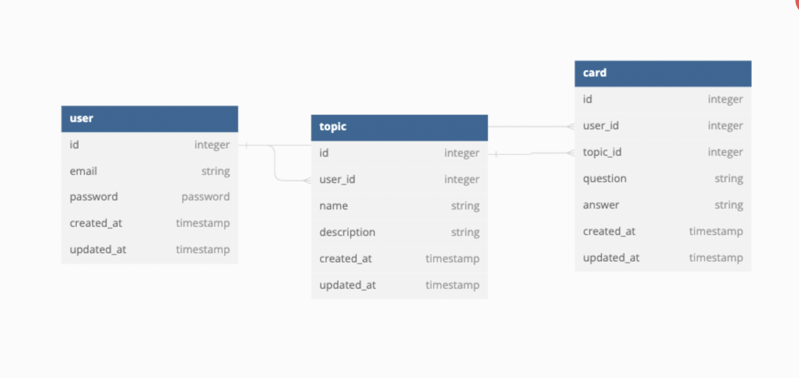

# Brain Buddy
Brain Buddy is the ultimate companion for your learning journey!  Revolutionize the way you study and retain information with our cutting-edge flashcard application. Whether you're a student, professional, or lifelong learner, Brain Buddy adapts to your unique learning style. 

## Tech Stack 

  
  
  
          
       

The frontend of Brain Buddy is built using:
-  Next.js
- Typescript
- Tailwind.
          
The backend of Brain Buddy is built using:
-  Ruby on Rails.

## Design
Careful planning went into this application, including a fully prototyped [Figma wireframe](https://www.figma.com/file/sFmDbqHewBGILD08ajv9fk/Brain-Buddy?type=design&node-id=9%3A341&mode=design&t=Tvwg31Jp7wgtAIOl-1)

## Structure
MVP for Brain Buddy is to have a simple, yet efficient application that allows a user to create flashcards and group them to a topic. To implement this, there are currently 3 tables - User, Topic, and Card as seen in the diagram below:

The backend repo for Brain Buddy can be found [here](https://github.com/elysemontano/brain-buddy-backend)

## Running the Frontend with Next.js:
To get the Brain Buddy backend up and running using Ruby on Rails, follow these steps:

1. Clone the repository
2. Navigate to the frontend directory
3. Install dependencies: `npm i`
4. Run the frontend server with Next.js: `npm run dev` 
5. Access the frontend at `http://localhost:3000`.

## Future Goals
The goal for Brain Buddy goes beyond MVP and will integrate the ability to share and save topics, search categories, and score your proficiency in a topic. Stay tuned for future updates!
